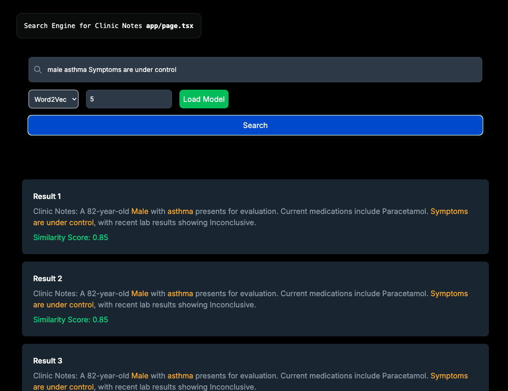
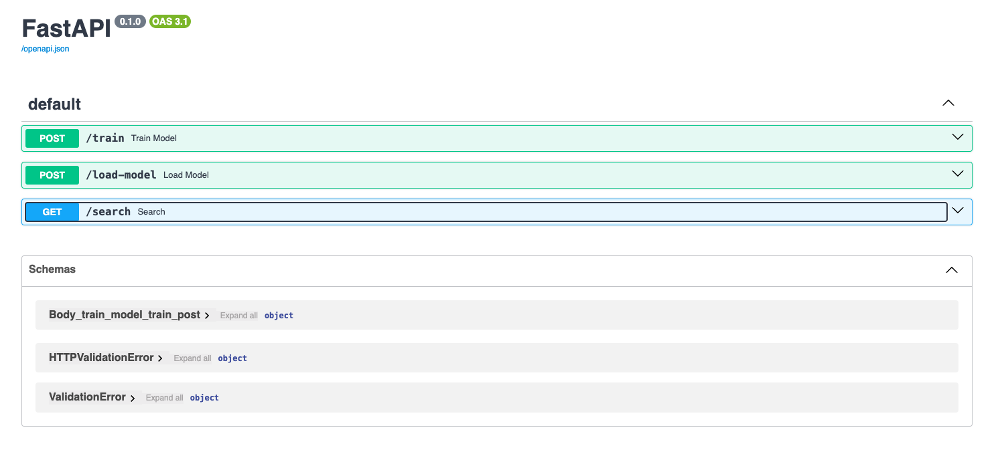
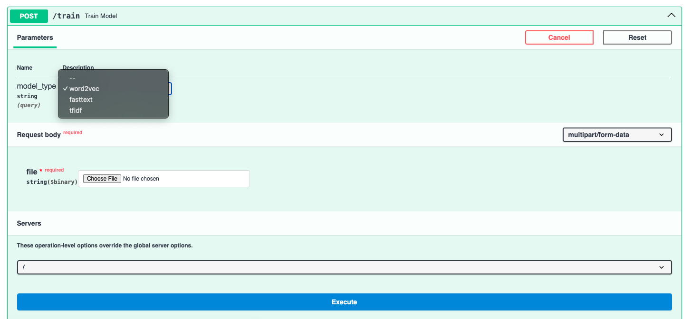
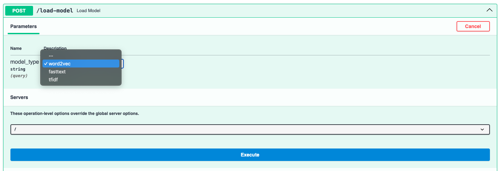
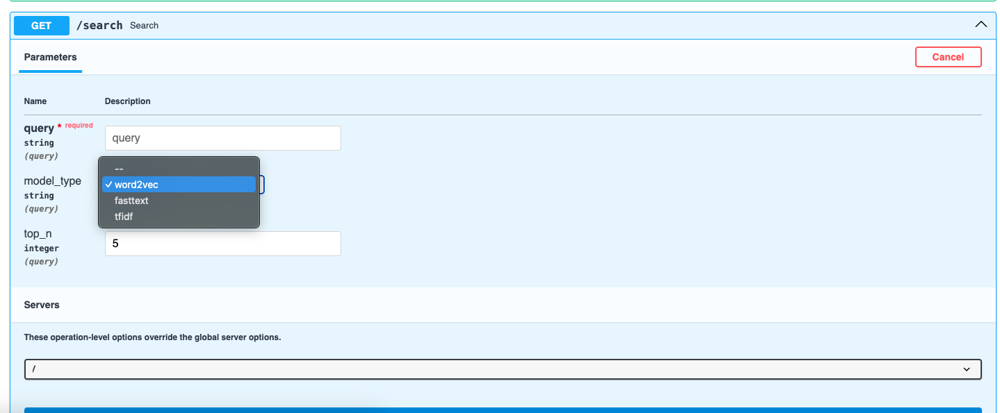

# search engine IR NLP (TF IDF, WORD2VEC, FASTTEXT)

## run server in folder new

`uvicorn my_app:app --reload`

### PENJELASAN 
- jika belum train model, train dahulu dengan upload csv file yang ada di new folder "healthcare_dataset_with_clinic_notes.csv" atau file yang ada clininc notes

- jika sudah train semua dan ingin search pastikan reload model yang ingin di gunakan

- lakukan search seperti penyakit atau gejala atau obat

- NOTE: tidak perlu train ulang jika ingin search cukup load mode dengan endpoint load

## run frontend in folder frontend

`npm run dev`
